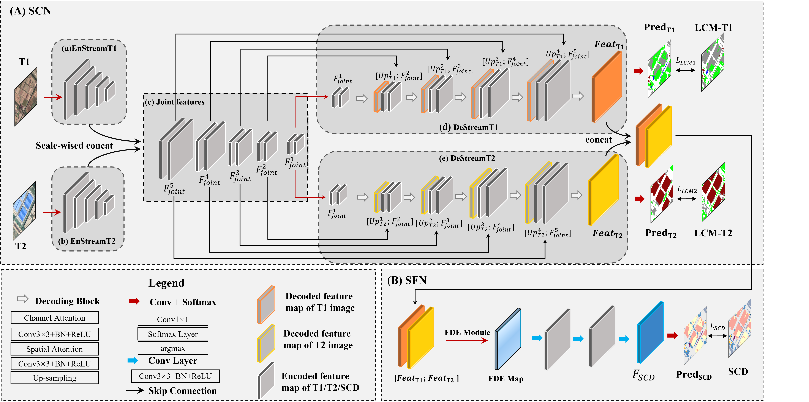

# Deep-Siamese-Post-Classfication-Fusion-Network
This is the implementation of Deep Siamese Post Classfication Network for Semantic Change Detection in Multi-temporal Remote Sensing Images

We provide Paddle & Pytorch codes of PCFN.

## Paddle 
version: PaddlePaddle 2.0.1  
Optimizer: SGD  
Lr： 0.007  
Schedule： ReduceOnPlateau (Factor=0.3)  

## Pytorch
We only tested SCN (the sub-network of PCFN) in the compeitition hosted by SenseTime in 2020 (Ranked 9th)

Optimizer: SGD  
Lr： 0.007  
Schedule： ReduceOnPlateau (Factor=0.1)  
Test time augmentation (TTA)  

Loss: 
 
Note that the class weights need to be set inversely proportional to the number of training examples or manually in $L_\text{SCD}$

## Datasets
We merge the land cover categories in SECOND dataset, the processed dataset can be available in [BaiduDrive](链接地址 "（可选）添加一个标题").  
For the origianl SECOND dataset, please contact CAPTAIN-WHU.  
Since images of HRSCD cannot be distributed in the network, we could not share the HRSCD dataset. If you need, please contact Dr.Daudt.

## Future Work
1. integrate thematic indices ([RGBi](https://rdrr.io/cran/uavRst/man/rgb_indices.html "（可选）添加一个标题") or NIRi) with CNN in arieal images. 
e.g.   Vegtation Indice (VI) in RGB images  
 

2. the semi-supervised or unsupervised design of soft fusion strategy with CNN.
3. the method of 1st winner in SenseTime 2020 RS competition is excellent.
